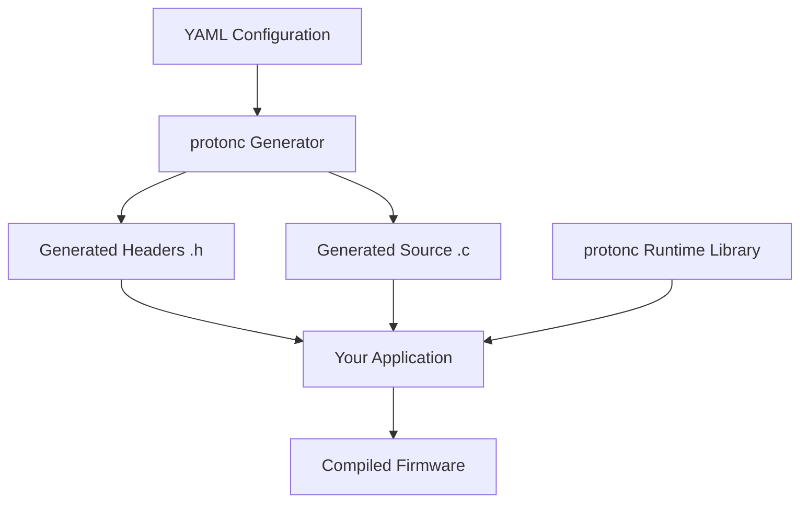
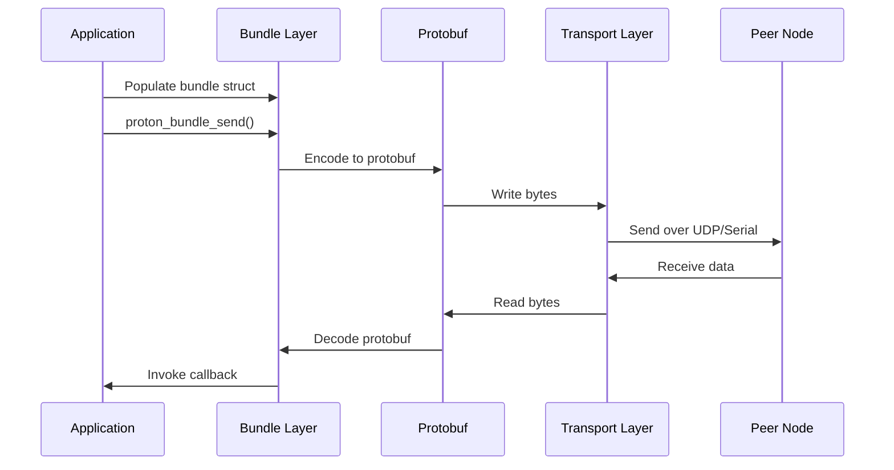

# protonc

**protonc** is the C implementation and code generation toolchain for the Proton protocol. It's designed specifically for embedded systems and resource-constrained microcontrollers where memory and CPU are limited. It uses `nanopb` to encode and decode the protobuf bundles.

## What protonc is

protonc consists of two main components:

### Code Generator (Python-based)

A Python tool that reads YAML configuration files and automatically generates:

- **C header files** (`.h`) with type definitions, structs, enums, and function prototypes
- **C source files** (`.c`) with initialization, encoding, decoding, and send/receive logic
- **Per-node implementations** - generates different code for each node

The generator is a Python package with:

| File                   | Purpose                                          |
| ---------------------- | ------------------------------------------------ |
| `protonc_generator.py` | Main code generation logic                       |
| `config.py`            | YAML parsing and configuration representation    |
| `source_writer.py`     | Helper for writing C code with proper formatting |

### C Runtime Library

Core C implementation providing:

- **Signal/Bundle handling** - Initialization, encoding/decoding via nanopb (protobuf for embedded)
- **Node management** - Peer initialization, configuration, activation
- **Transport abstraction** - Connect/disconnect/read/write interfaces
- **Serial framing** - Magic bytes (`0x50`, `0x52`), length encoding, CRC16 validation

## How protonc Works

### Code Generation Process

#### 1. Parse YAML Configuration

Reads nodes, connections, and bundle definitions and validates structure to create internal representation.

#### 2. Generate Type Definitions

For each bundle, creates C structs like:

```c
typedef struct {
  uint32_t level;
  char name[64];
  char msg[64];
  uint32_t line;
} log_bundle_t;
```

#### 3. Generate Bundle Management

- **Init functions**: `proton_bundle_<name>_init()` - Sets up signal handles and buffers
- **Encode functions**: Serialize bundle to protobuf binary format
- **Decode functions**: Deserialize received data into bundle structs
- **Send functions**: `proton_bundle_send()` - Encode and transmit to appropriate peers

#### 4. Generate Node Initialization

- Per-node initialization functions
- Peer relationship setup
- Callback registration infrastructure
- Transport configuration

#### 5. Generate Callback Infrastructure

```c
void proton_bundle_<name>_callback(void * context);
```

User implements these callbacks to handle received bundles.


### Runtime Operation

#### Initialization Flow

```c
// 1. Configure node
proton_node_t node = PROTON_NODE_DEFAULT("mcu");

// 2. Initialize peers (other nodes you communicate with)
proton_init_peer(&peer, id, heartbeat, transport, ...);

// 3. Configure node with peers and buffers
proton_configure(&node, heartbeat, lock, unlock, buffer, peers, count, context);

// 4. Activate node (start communication)
proton_activate(&node);
```

#### Sending Data

```c
// 1. Populate bundle struct
bundles.status.mcu_uptime = 12345;
bundles.status.firmware_version = "v1.0";

// 2. Send to peer
proton_bundle_send(&node, PEER_PC, BUNDLE_STATUS);
```

#### Receiving Data

```c
// 1. Spin to check for incoming data
proton_spin_once(&node, peer_id);

// 2. When bundle arrives, your callback is invoked
void proton_bundle_motor_command_callback(void * context) {
  // Access received data via generated bundle structs
  float speed = context->bundles.motor_command.drivers[0];
}
```

## Key Design Principles

protonc is optimized for embedded systems with strict resource constraints.

1. **Zero-copy where possible** - Direct buffer access, minimal data copying
2. **Static memory allocation** - All buffers pre-allocated, no malloc/free
3. **Embedded-friendly** - Uses nanopb instead of full protobuf library
4. **Type-safe** - Generated structs prevent type errors

## What Gets Generated

For a YAML config with nodes `mcu` and `pc`:

### Generated Files

- `proton__<node>.h` - Header with structs, enums, and prototypes
- `proton__<node>.c` - Implementation for that specific node

### Per Bundle

- Struct definition with all signals
- Init function to set up the bundle
- Encode/decode functions using nanopb
- Send function that routes to correct peers

### Example Generated Code Structure

```c
// Bundle struct
typedef struct {
  uint32_t mode;
  float drivers[2];
} motor_command_bundle_t;

// Bundles container for this node
typedef struct {
  log_bundle_t log_bundle;
  status_bundle_t status_bundle;
  motor_command_bundle_t motor_command_bundle;
  // ... more bundles
} proton_bundles_mcu_t;

// Initialization
proton_status_e proton_node_init(proton_node_t *node, ...);
proton_status_e proton_bundle_init(...);

// Callbacks (user implements)
void proton_bundle_motor_command_callback(void *context);
```

## Architecture Diagram



## Data Flow



## Usage Example

### YAML Configuration

```yaml
nodes:
  - name: mcu
    heartbeat:
      enabled: true
      period: 100
    endpoints:
      - id: 0
        type: serial
        device: /tmp/ttyMCU

bundles:
  - name: motor_command
    id: 0x200
    producers: pc
    consumers: mcu
    signals:
      - {name: mode, type: int32}
      - {name: drivers, type: list_float, length: 2}
```

### Generated Code Usage

```c
#include "proton__mcu.h"

typedef struct {
  proton_node_t * node;
  proton_bundles_mcu_t bundles;
} context_t;

void proton_bundle_motor_command_callback(void * context) {
  context_t * c = (context_t *)context;

  // Access received data directly from generated struct
  int32_t mode = c->bundles.motor_command.mode;
  float left_speed = c->bundles.motor_command.drivers[0];
  float right_speed = c->bundles.motor_command.drivers[1];

  // Process motor command...
}

int main() {
  context_t context;
  proton_node_t node = PROTON_NODE_DEFAULT("mcu");

  // Initialize and configure node...
  proton_node_init(&node, ...);
  proton_activate(&node);

  // Main loop
  while(1) {
    proton_spin_once(&node, PEER_PC);
  }
}
```

## Benefits

<!-- <Tabs defaultValue="embedded">
  <TabsList>
    <TabsTrigger value="embedded">For Embedded</TabsTrigger>
    <TabsTrigger value="developers">For Developers</TabsTrigger>
  </TabsList>
  <TabsContent value="embedded">
    - Minimal memory footprint
    - Predictable performance (no dynamic allocation)
    - Works with or without RTOS
    - Supports resource-constrained MCUs
  </TabsContent>
  <TabsContent value="developers">
    - No manual serialization code
    - Type-safe communication
    - Automatic code generation from config
    - Clear separation of concerns
    - Easy to maintain and extend
  </TabsContent>
</Tabs> -->

## Summary

protonc essentially takes high-level YAML configuration and generates all the boilerplate C code needed for type-safe, efficient communication - you just implement your callbacks and application logic.

The tool bridges the gap between configuration (what you want to communicate) and implementation (how to communicate it), allowing embedded developers to focus on application logic rather than protocol plumbing.
